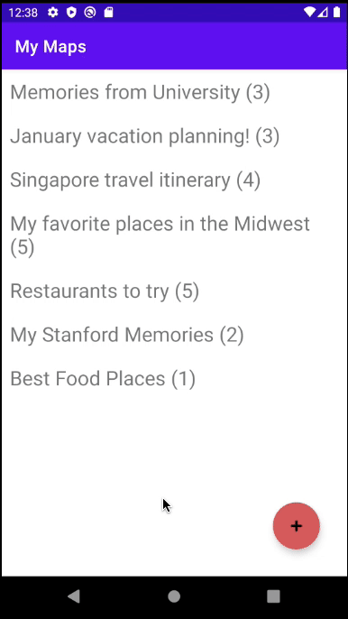

# My Maps

## *Wilmer Zuna*

**My Maps** displays a list of maps, each of which show user-defined markers with a title, description, and location. The user can also create a new map.

Time spent: **6** hours spent in total

## Functionality

The following **required** functionality is completed:

* [X] The list of map titles is displayed.
* [X] After tapping on a map title, the associated markers in the map are shown.
* [X] The user is able to create a new map.

The following **extensions** are implemented:

* [X] The list of map titles also display the number of markers associated in them.

## Video Walkthrough

Here's a walkthrough of implemented user stories:

GIF created with [EZGif.com](https://ezgif.com/).

## Notes

A lot of the main work was interesting to tackle. Overall, a really useful learning experience for interacting
with multiple activities in an app and transferring data between. I also did enjoy the storing of information
locally in order to preserve the data beyond the current user session use.
I definitely wish to work on similar projects in the future!

## License

    Copyright [yyyy] [name of copyright owner]

    Licensed under the Apache License, Version 2.0 (the "License");
    you may not use this file except in compliance with the License.
    You may obtain a copy of the License at

        http://www.apache.org/licenses/LICENSE-2.0

    Unless required by applicable law or agreed to in writing, software
    distributed under the License is distributed on an "AS IS" BASIS,
    WITHOUT WARRANTIES OR CONDITIONS OF ANY KIND, either express or implied.
    See the License for the specific language governing permissions and
    limitations under the License.